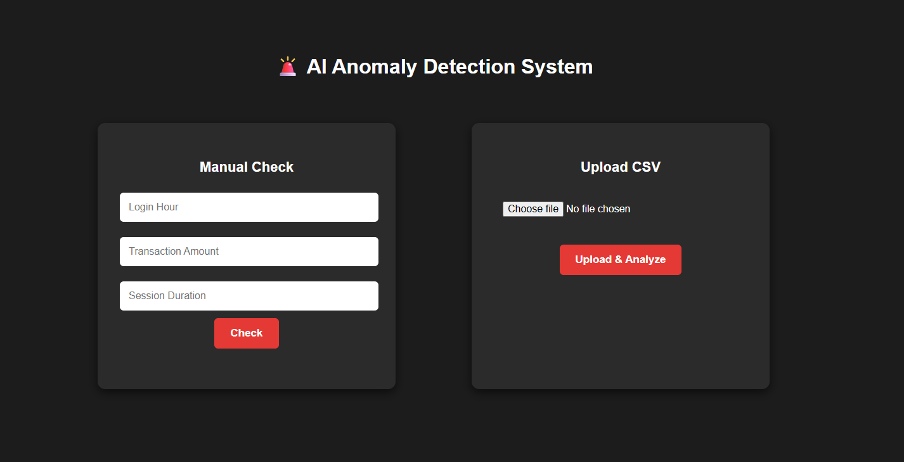

# 🚨 AI Anomaly Detection System

## 📌 Overview

This is a web-based AI system that detects anomalous (suspicious) transactions using machine learning.

The system allows:

* Manual transaction input
* CSV file upload for bulk anomaly detection

---

## 🖥️ UI Preview



---

## 🚀 Features

* Manual anomaly detection
* CSV upload & bulk analysis
* Real-time API predictions
* Clean modern UI (dark theme)

---

## 🛠️ Tech Stack

* FastAPI (Backend)
* HTML, CSS, JavaScript (Frontend)
* Scikit-learn (Isolation Forest Model)
* Uvicorn Server

---

## ▶️ How to Run

### Backend

```bash
cd backend
python -m uvicorn main:app --reload
```

### Frontend

```bash
cd frontend
python -m http.server 5500
```

Open:
http://127.0.0.1:5500

---

## 📊 API Endpoints

* POST `/predict` → single input prediction
* POST `/upload-csv` → bulk anomaly detection

---

## 📂 Project Structure

* backend → API & model
* frontend → UI
* dataset → sample data
* model → trained ML model

---

## 💡 Future Improvements

* Add graphs & analytics dashboard
* Improve model accuracy
* Deploy online


